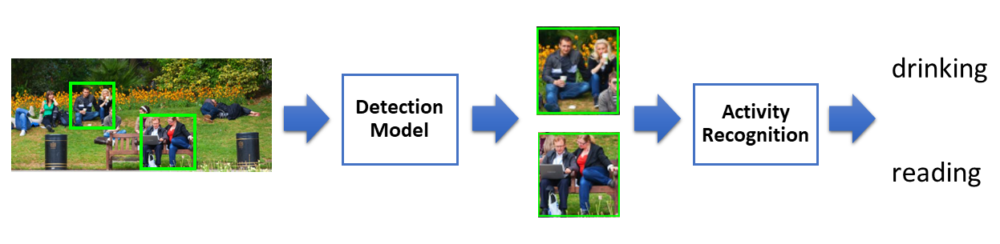

# YOLOv2 in Keras and Applications for Cascading People Activity Recognition




This repo contains the implementation of YOLOv2 in Keras with Tensorflow backend. It supports training YOLOv2 network with various backends such as MobileNet and InceptionV3.

This forked repository is modified for AT:70.9022 Machine Learning Course Project.

Here is the [project paper](https://drive.google.com/open?id=1Mh3r7UGbt5j-X-NNTaDVJZA_nNAduO4L) for this implementation.


Original Implementation can be found at https://github.com/experiencor/keras-yolo2 .

## Usage for python code

### 0. Requirement

python 3.x

keras >= 2.0.8

imgaug

tensorflow-gpu >= 1.6.0 (or cpu)

opencv-python

### *****In order to avoid potential environment configuration conflicts, we recommend to use virtualenv or Docker

Virtualenv:

`sudo apt-get install python3-pip`

`sudo pip3 install virtualenv`

`virtualenv --python=python3 --no-site-packages <virtual_enviroment_name>`


`echo "alias activate_env=\"source ~/<virtual_enviroment_name>/bin/activate\"" >> ~/.bashrc`

`source .bashrc`

`activate_env`

`sudo apt-get install python3-tk`
 
`(<virtual_enviroment_name>) pip3 install Cython numpy`

`(<virtual_enviroment_name>) pip3 install -r requirements.txt`


### 1. Data preparation

Organize the dataset into 4 folders:
#### 1.1. People Detection Dataset
+ train_image_folder <= the folder that contains the train images.

+ train_annot_folder <= the folder that contains the train annotations in VOC format.

+ valid_image_folder <= the folder that contains the validation images.

+ valid_annot_folder <= the folder that contains the validation annotations in VOC format.

##### 1.1.1 If you are using [MicrosoftCOCO](http://cocodataset.org) dataset for People Detection

Use `coco2pascal_person.py` to convert COCO annotations to VOC format. It filters only "Person" category label. You can select either coco 2014 or 2017 dataset.

Usage:

  `python3 coco2pascal_person.py create_annotations <COCO_annotations_folder> <subset: train/val> <output_folder> <coco_dataset_year (default 2017)>`

Requirements:

   `pip3 install path.py baker scipy lxml`

   `pip3 install Cython`

   `pip3 install cytoolz`
   
#### 1.2. Activity Recognition Data format

Since we use [ImageDataGenerator.flow_from_directory](https://keras.io/preprocessing/image/) API from Keras, the images dataset should be organized in classes: each subfolder is the class name containing its class images. 

The training set and the validation set should be seperated in advance.

The original dataset we used to train this model is [Standford 40 Actions](http://vision.stanford.edu/Datasets/40actions.html) with selected 7 classes actions (applauding, drinking, jumping, phoning, reading, running, waving hands).


    

### 2. Edit the configuration file

#### 2.1 For People Detection
The configuration file is a json file, which looks like this:

```python
{
    "model" : {
        "architecture":         "Full Yolo",    # "Tiny Yolo" or "Full Yolo" or "MobileNet" or   "SqueezeNet" or "Inception3" or "ResNet50"
        "input_size":           416,
        "anchors":              [0.57273, 0.677385, 1.87446, 2.06253, 3.33843, 5.47434, 7.88282, 3.52778, 9.77052, 9.16828],
        "max_box_per_image":    10,        
        "labels":               ["person"],
        "backend_model": "/home/kandithws/ait_workspace/MachineLearning/pretrained_models/full_yolo_backend.h5" # Pretrained weights for backend model (i.e. from Imagenet), required for "Full Yolo", "Tiny Yolo", "Inception3" and "SqueezeNet". For other models will directly download from Keras (internet required)
    },
    "path" :{
        "dataset_path": "/home/kandithws/ait_workspace/MachineLearning/datasets/coco/", # path to the root of dataset folder in which has annotations and image folder
        "models_save_path": "/home/kandithws/ait_workspace/MachineLearning/models/" # path to save a trained model and load a previously trained model.
    },

    "train": {
        "train_image_folder":   "train2017/", # should be inside dataset_path
        "train_annot_folder":   "voc_annotations_train/",  # should be inside dataset_path     
          
        "train_times":          1,             # the number of time to cycle through the training set, useful for small datasets
        "previous_model":   "",             # specify the path of the prevoiusly trained weights, but it's fine to start from scratch (will randomize the initial weight instead)
        "batch_size":           16,             # the number of images to read in each batch
        "learning_rate":        1e-4,           # the base learning rate of the default Adam rate scheduler
        "nb_epoch":             50,             # number of epoches
        "warmup_epochs":        3,              # the number of initial epochs during which the sizes of the 5 boxes in each cell is forced to match the sizes of the 5 anchors, this trick seems to improve precision emperically

        "object_scale":         5.0 ,           # determine how much to penalize wrong prediction of confidence of object predictors
        "no_object_scale":      1.0,            # determine how much to penalize wrong prediction of confidence of non-object predictors
        "coord_scale":          1.0,            # determine how much to penalize wrong position and size predictions (x, y, w, h)
        "class_scale":          1.0,            # determine how much to penalize wrong class prediction

        "debug":                true            # turn on/off the line that prints current confidence, position, size, class losses and recall
    },

    "valid": {
        # if validation set is not specified, will use 80:20 of the training set
        "valid_image_folder":   "val2017/",
        "valid_annot_folder":   "voc_annotations_val/",

        "valid_times":          1
    }
}

```

The model section defines the type of the model to construct as well as other parameters of the model such as the input image size and the list of anchors. The ```labels``` setting lists the labels to be trained on. Only images, which has labels being listed, are fed to the network. The rest images are simply ignored. By this way, a Person Detector can easily be trained using VOC or COCO dataset by setting ```labels``` to ```['person']```.

Download pretrained weights for backend_model (tiny yolo, full yolo, squeezenet, mobilenet, and inceptionV3) at:

https://1drv.ms/f/s!ApLdDEW3ut5fec2OzK4S4RpT-SU


### 3. Generate anchors for your dataset (optional)

`python gen_anchors.py -c config.json`

Copy the generated anchors printed on the terminal to the ```anchors``` setting in ```config.json```.

### 4. Start the training process

#### 4.1 People Detection Model

`python train.py -c config.json`

By the end of this process, the code will write the weights of the best model to file best_weights.h5 (or whatever name specified in the setting "saved_weights_name" in the config.json file). The training process stops when the loss on the validation set is not improved in 3 consecutive epoches.


#### 4.2 Activity Recognition Model

Use `train_activity.py`

Parameters configurations can be modified directly in the file.


### 5. Perform detection using trained weights on an image by running
`python predict.py -c config.json -w /path/to/best_weights.h5 -i /path/to/image/or/video`

It carries out detection on the image and write the image with detected bounding boxes to the same folder.

## Evaluation of the current implementation:

| Train        | Test          | mAP (with this implementation) | mAP (on released weights) |
| -------------|:--------------|:------------------------:|:-------------------------:|
| COCO train   | COCO val      | 28.6 |    42.1 |

The code to evaluate detection results can be found at https://github.com/experiencor/basic-yolo-keras/issues/27.


### 6.Perform realtime prediction People Activity Recognition from WebCam

Please download our trained activity models from 
here: https://drive.google.com/open?id=143OFmoPiFhDpQ-VvBZnm4QM5p0x26oie (activity.h5 + 1 other model)

Configurations path to the model (DETECTION_MODEL_PATH, ACTIVITY_MODEL_PATH) inside
`activity_realtime_demo.py` and run it.


## Copyright

See [LICENSE](LICENSE) for details.
